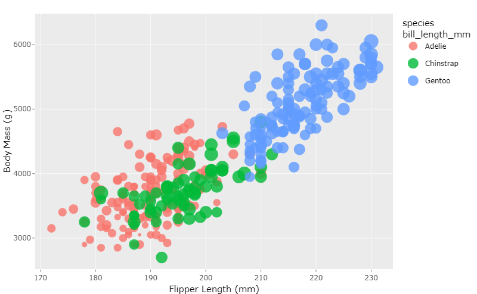
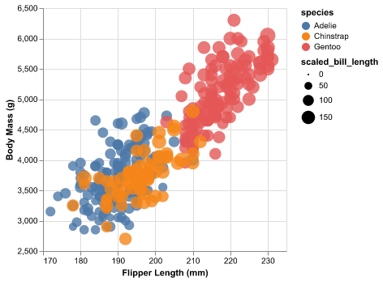
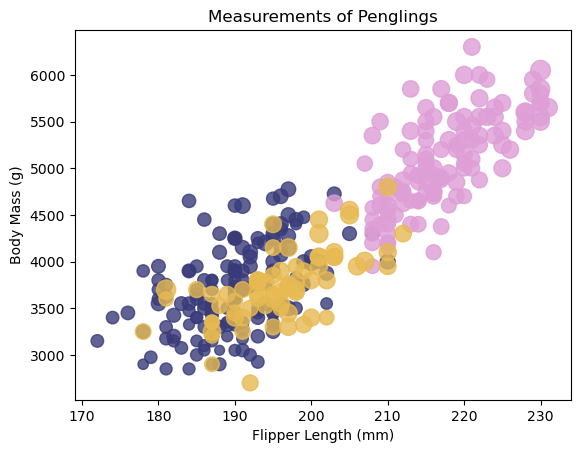

# Rachel Conca Assignment 2: 5 Ways

## Intro/Some Notes

For each of these visualizations, I wrote all the code myself with aid from online documentations with tweaks to make them applicable to the dataset I was using.

For ease of coding I also made copies of the CSV file for each different tool (I did two visualizations using Python, so I just did them on the same file) since I didn't want to deal with any pathing issues that might pop up.

## Part 1: R and ggplot2

The first tool/library I chose to use was R and ggplot2. R is a mainly statistical programming language, but has some good visualization build-ins/libraries as well. The standard R library has some visualization generation built in, but I chose to use ggplot2 since it was more customizable and comes out looking nicer than the standard packages.

Finding the documentation for ggplot2 wasn't too difficult, and functioned very similar to most Python libraries which was nice. The main challenge I had was that I usually prefer to use VSCode for coding since it has good GitHub integration, but didn't work well with the Rmd file, so I had to use RStudio to do the coding rather than just using VSCode like I normally do. Since I have experience with R and RStudio, this wasn't too big of a deal, just a little annoying.

It was also very easy to add an interactivity feature to the plot with a detailed tooltip and zoom/selection functionalities via plotly. Despite using R for over 3 years at this point, I had no idea you could make interactive plots in R but you learn something new every day.

**R/ggplot2 Plot:**

## Part 2: Python and Altair

For my second visualization, I chose to use Python's Altair library which is a popular visualization library. Similar to ggplot2, I didn't have too much of an issue finding documentation to make my plot. One thing I liked about the Altair library was how easy it was to make my plot interactive and how well the interactivity worked by just adding a few additional lines of code.

One thing I noticed about the Python library plots (same thing happened when I used matplotlib later) was that the size scaling didn't really do all that much and it was very hard to tell the difference between the sizes of bill lengths, so I ended up Min Max scaling that column which helped a little bit.

**Altair Plot:**

*Note: If you open the notebook file and run the code, the plot has interactivity (you can select multiple points and the tooltip tells you the species of pengling).*

## Part 3: Power BI

Power BI is a tool in the Microsoft Suite designed around making data visualization and analysis quick and easy as it is most commonly used in business applications where not everyone is familiar with how to work with data.

I chose Power BI since I had used Tableau in the past and found it to be a relatively simple yet very useful platform to visualize data, and as a Data Science major it would be beneficial to learn how to use an inexpensive alternative to Tableau as well. I initially started to do my work on the browser version, but that version doesn't have much functionality and is laid out in a very counterintuitive way, leading me to download the desktop version.

The desktop version was much easier to use, and I was able to customize much more of my visualization than I was on the browser version which was nice. I like how a lot of the interactivity aspects (zoom, point selection, tooltips) that I would normally have to code myself are already built into the software. Additionally, the custom sized points were so much better than the ones from the R/Python libraries since they actually have a decent amount of size variation without having to do any outside work to scale the points properly.

One thing I did not like was that sharing your visualization was a paid feature, so outside people either need to download the Power BI file or just use the downloadable PNG file.

**Power BI Plot:**

## Part 4: D3

For the next part, I chose to use the D3 library, which is a comprehensive data visualization library for JavaScript. Out of all the options I chose for this project, D3 was the most difficult one since I had basically 0 JavaScript/HTML experience prior to this class and D3 gives the user customization options for basically every aspect of a visualization which can get pretty overwhelming.

Documentation for D3 was relatively easy to find, and there were quite a few in-depth tutorials for exactly what I wanted to do which was nice. Getting everything to look even somewhat presentable took a lot of trial and error, but I feel a lot more confident about using D3 and understanding a bit more about how everything works now.

Since D3 essentially allows the user to customize every aspect of their visual, the interactive features I added to my plot were a lot "jankier" than the interactive features in other libraries. The tooltip function doesn't really work too well in highly clustered areas whereas the tooltips in other libraries/tools work just fine no matter where they're being used.

**D3 Plot:**

## Part 5: Matplotlib

Matplotlib is a highly popular Python library for data visualization. In most data science/statistics related classes, this is the library most commonly used, so I wanted to see how it compared to some of the other libraries I already used.

It's formatted very similarly in syntax to the other Python library I used (Altair) and was easy to find the documentation for how to use it. Compared to other libraries, this one felt less customizable and looked more "rushed" than some of the other visualizations I made. It was also difficult to add any interactivity to the plot as the documentation for that was confusing and didn't seem to work for this specific plot.

Overall this library is great for getting visualizations done quickly (good for assignments/reports) but lacks some of the visual quality of other libraries.

**Matplotlib Plot:**

## Conclusions/Achievements

Overall, my goal with this assignment was to test out different tools for data visualization to see how they compared to each other for different applications. 

### Technical Achievements:

For most graphs, I tried to add an interactive element to them so that users could explore the data in more detail. I was able to do this for each plot minus the Matplotlib one. All the interactive plots have a tooltip that gives varying amounts of information about the point, and the Altair and Power BI visualizations allow users to select specific points.

### Design Achievements

In terms of design, all the plots are colored in a way that you can tell the difference between the three species of pengling, and the colors contrast with the background of the plot so that they aren't invisible.

On each of the plots, the size of the points vary based on the bill length of the penglings, although the amount of variation changes drastically between the different tools. The biggest contrast in sizes is on the Power BI plot, while the Python and D3 plots have the least amount of contrast in point sizes.